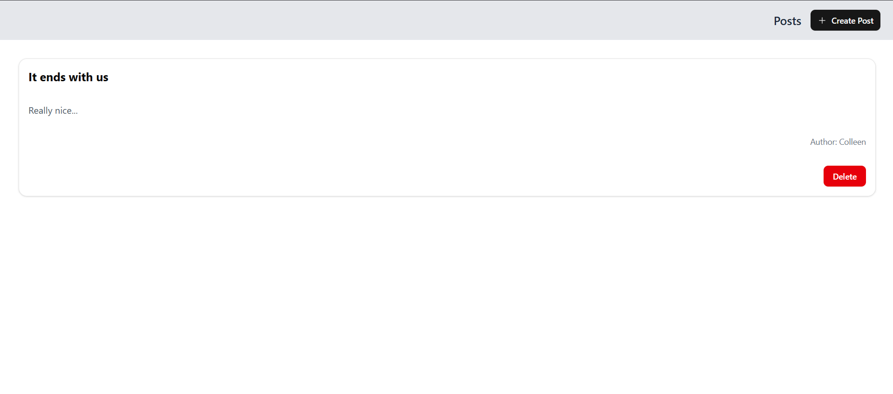

# 📝 MERN Blog Platform

A full-stack blogging platform built with the MERN stack (MongoDB, Express.js, React, and Node.js). Users can sign up, log in, create, list, and delete blog posts.

---

## 🌐 Project Overview

This application allows users to:

- 🔐 Sign up and log in securely
- ✍️ Create new blog posts
- 📃 View a list of all posts
- ❌ Delete blog posts

It supports token-based authentication and uses a clean component-based UI built with modern React practices.

---

## ⚙️ Tech Stack

**Frontend:**
- React (with Vite)
- Axios
- Tailwind CSS (via Shadcn/UI components)
- React Router DOM

**Backend:**
- Express.js
- MongoDB with Mongoose
- JWT (JSON Web Token) for authentication
- CORS and dotenv

---

## 🚀 Setup Instructions

### 🖥️ 1. Clone the Repository

```bash
git clone https://github.com/yourusername/mern-blog.git
cd mern-blog
````

---

### 📦 2. Backend Setup

```bash
cd server
pnpm install
```

#### ⚙️ Environment Variables

Create a `.env` file inside the `/server` directory:

```env
PORT=5000
MONGO_URI=your_mongodb_connection_string
JWT_SECRET=your_jwt_secret_key
```

#### ▶️ Start Backend

```bash
pnpm dev
```

---

### 🌐 3. Frontend Setup

```bash
cd client
pnpm install
```

#### ▶️ Start Frontend

```bash
pnpm run dev
```

The frontend runs at `http://localhost:5173` and communicates with the backend at port `5000`.

---

## 🔌 API Documentation

### 🔐 Authentication

#### `POST /api/auth/signup`

Registers a new user.

**Request Body:**

```json
{
  "name": "John Doe",
  "email": "john@example.com",
  "password": "123456"
}
```

**Response:**

```json
{
  "message": "User registered successfully"
}
```

---

#### `POST /api/auth/login`

Logs in an existing user.

**Request Body:**

```json
{
  "email": "john@example.com",
  "password": "123456"
}
```

**Response:**

```json
{
  "token": "JWT_TOKEN",
  "user": {
    "_id": "userid",
    "name": "John Doe",
    "email": "john@example.com"
  }
}
```

---

### 📬 Posts

#### `GET /api/posts`

Returns all blog posts.

---

#### `POST /api/posts` *(Requires Auth)*

**Headers:**

```http
Authorization: Bearer <token>
```

**Request Body:**

```json
{
  "title": "Sample Post",
  "content": "This is a blog post content.",
  "author": "Jane Doe",
  "category": "Tech"
}
```

**Response:**

```json
{
  "_id": "postid",
  "title": "Sample Post",
  ...
}
```

---

#### `DELETE /api/posts/:id` *(Requires Auth)*

Deletes a post by its ID.

---

## ✨ Features Implemented

* ✅ User Authentication (Signup & Login)
* ✅ JWT Protected Routes
* ✅ Create Post (with auto-generated slug)
* ✅ List All Posts
* ✅ Delete Post
* ✅ Author and Category as string fields
* ✅ Clean and responsive UI (Shadcn + Tailwind)

---

## 📁 Folder Structure

```
client/
  └── pages/
      ├── Login.jsx
      ├── Signup.jsx
      ├── PostForm.jsx
      └── PostList.jsx
  └── services/
      └── api.js
  └── App.jsx
  └── main.jsx

server/
  └── models/
      ├── Post.js
      ├── User.js
      └── Category.js
  └── controllers/
      ├── authController.js
      └── postController.js
  └── routes/
      ├── authRoutes.js
      └── postRoutes.js
  └── server.js
```

---

## 🖼️ Screenshot



---

## 📌 Notes

* Ensure MongoDB is running locally or use MongoDB Atlas.
* You can extend the app with features like:

  * 📝 Post editing
  * 🖼️ Image uploads
  * 💬 Commenting system
  * 🔒 Role-based access

---

## 📃 License

MIT © 2025
